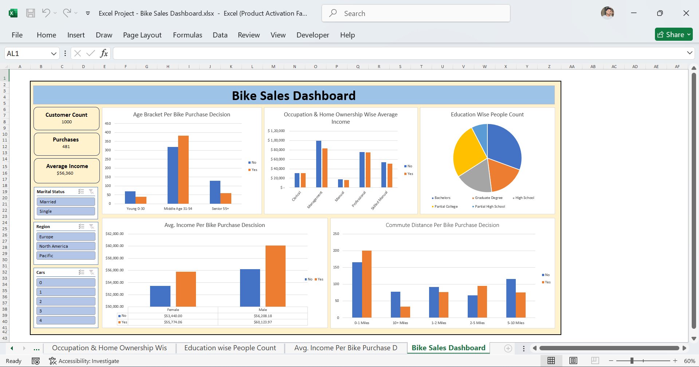

# 🚴 Bike Sales Dashboard


---

## 📌 Project Overview

Developed an interactive Bike Sales Dashboard in Microsoft Excel to analyze customer demographics, purchasing behavior, and sales trends. The dashboard helps identify factors that influence bike purchases and supports data-driven business decisions.

---

## 🎯 Objectives

- Analyze customer purchasing behavior
- Identify demographics influencing bike sales
- Compare income across customer groups
- Evaluate commute distance and purchasing trends
- Build an interactive dashboard using Excel

---

## 🛠 Tools Used

- Microsoft Excel
- Pivot Tables
- Pivot Charts
- Slicers
- Conditional Formatting

---

## 📷 Dashboard Preview



---

## 📊 Dashboard Features

- Customer Age Analysis
- Income Comparison
- Gender Analysis
- Marital Status Analysis
- Education Analysis
- Occupation Analysis
- Commute Distance Analysis
- Interactive Slicers

---

## 💡 Business Insights

- Identified customer groups most likely to purchase bikes.
- Compared purchasing behavior across age, income, and gender.
- Analyzed how commute distance impacts bike purchases.
- Built an interactive dashboard for business reporting.

---

## 📂 Folder Structure

```text
02-Excel-Bike-Sales-Dashboard
│
├── README.md
├── LICENSE
├── Dashboard
│   └── Excel Project - Bike Sales Dashboard.xlsx
└── Images
    └── Dashboard.png
```

---

## 👨‍💻 Author

**Shivam Choudhry**
